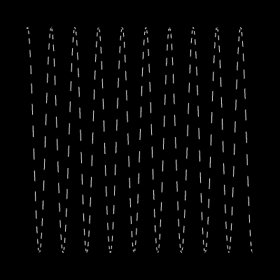

# Simple WebGL 2D Plotting



* PROS: Extremely basic
  * 9.83 kB unpacked size
  * 1 single function `buildPlotWebGL`
* CONS: cannot be used for any detailed/scientific plotting
  * No axes
  * No labels

# Installation

```bash
npm install basicwebglplot
```

# Usage 

* An example react app that uses this library

```js
import React from 'react';
import { useEffect, useRef } from 'react';
import {buildPlotWebGL, DrawModeGL} from 'basicwebglplot';

function App() {
  const refContainer = useRef<null | HTMLCanvasElement>(null);
  useEffect(()=>{
    buildPlotWebGL(refContainer.current as HTMLCanvasElement ,Math.sin,-30,30,0.1,DrawModeGL.LINES,400,400)
  },[refContainer])

  return (
    <div >
      <canvas ref={refContainer} width="500" height="500"></canvas>
    </div>
  );
}

export default App;
```

And here is an example without typescript

```js
import React from 'react';
import { useEffect, useRef } from 'react';
import {buildPlotWebGL, DrawModeGL} from 'basicwebglplot';

function App() {
  const refContainer = useRef(null);
  useEffect(()=>{
    buildPlotWebGL(refContainer.current ,Math.sin,-30,30,0.1,DrawModeGL.LINES,400,400)
  },[refContainer])

  return (
    <div >
      <canvas ref={refContainer} width="500" height="500"></canvas>
    </div>
  );
}

export default App;
```


# Development

## Making typedocs

```bash
npm run cleandocs
npm run docs #builds typedoc docs
npm run viewdocs #view docs locally
```

## Running storybook

```bash
npm run storybook
```

Export storybook as static page

```bash
npm run build-storybook
```